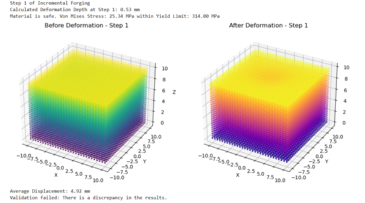
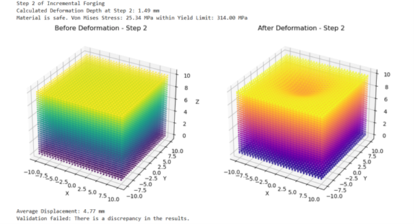
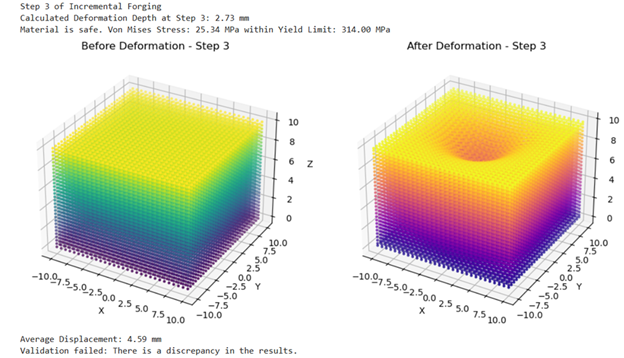
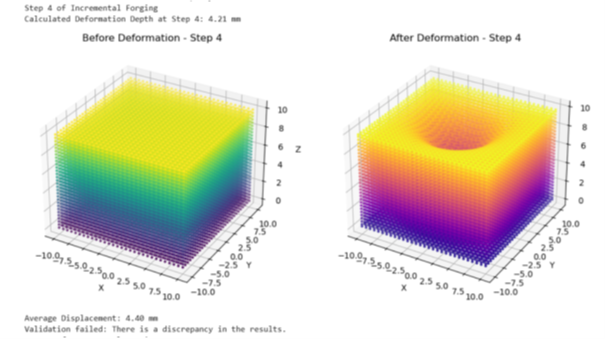
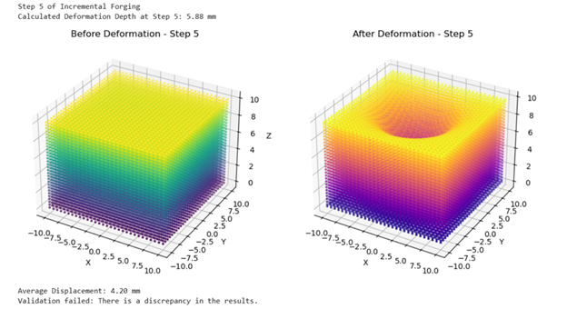
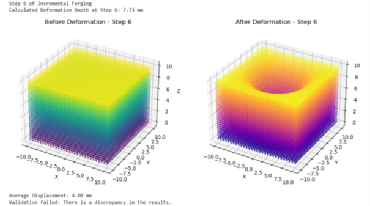

# Intelligent Forging Process Simulation

This project presents a simulation framework for incremental forging processes using plastomechanical modeling and IoT-based validation. The goal is to predict material deformation, analyze stress behavior, and improve manufacturing process efficiency.

---

## Project Overview

The simulation models how a workpiece deforms under repeated impacts by combining:

- Material property analysis  
- 3D grid discretization  
- Deformation depth calculation with strain hardening  
- Von Mises yield criterion  
- Gaussian-based material distribution  
- Validation using expected deformation values  

This approach supports Industry 4.0 concepts such as data-driven manufacturing and process optimization.

---

## Features

- Material property loading from CSV database  
- 3D workpiece modeling using voxel grid  
- Deformation depth calculation with strain hardening effects  
- Von Mises stress calculation for yield prediction  
- Realistic deformation using Gaussian distribution  
- Simulation validation framework  

---

## Technologies Used

- Python  
- NumPy  
- Pandas  
- Matplotlib  

---

## Simulation Workflow

The following figures show the step-by-step simulation process:

### Step 1: Grid Discretization  


### Step 2: Grid Visualization  


### Step 3: Deformation Depth Calculation  


### Step 4: Von Mises Yield Criterion  


### Step 5: Material Distribution  


### Step 6: Simulation Validation  


---

## How to Run the Project

1. Download or clone this repository  

2. Install required libraries:

```
pip install numpy pandas matplotlib
```

3. Run the Python file:

```
python forging_simulation.py
```

---

## Applications

- Intelligent Manufacturing Systems  
- Forging Process Optimization  
- Industry 4.0 Applications  
- Digital Manufacturing and Simulation  
- Data-driven Process Design  

---

## Future Improvements

- Integration with real IoT sensor data  
- Higher resolution simulation models  
- Advanced material behavior modeling  
- Machine learning-based optimization  

---

## Author

Maliha Rajwana Haque  
M.Sc. Intelligent Manufacturing  
Clausthal University of Technology  
